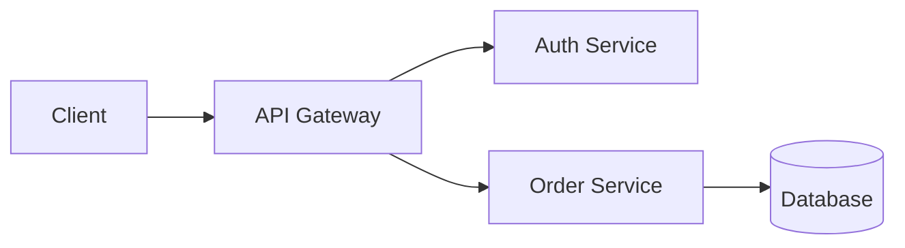
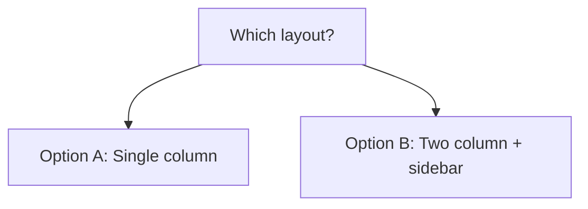

# Visual Companion Guide

Terminal-rendered visuals for showing mockups, diagrams, and options during brainstorming — without a browser or server.

## When to Use

Decide per-question, not per-session. The test: **would the user understand this better by seeing it than reading it?**

**Use a visual** when the content itself is visual:

- **Architecture diagrams** — system components, data flow, relationship maps
- **Layouts & wireframes** — navigation structures, component arrangement, page regions
- **Side-by-side comparisons** — two layouts, two flows, two design directions
- **State machines & flowcharts** — transitions, decision trees, pipelines
- **Spatial relationships** — entity relationships, hierarchy, containment

**Use plain text** when the content is text or tabular:

- **Requirements and scope questions** — "what does X mean?", "which features are in scope?"
- **Conceptual A/B/C choices** — picking between approaches described in words
- **Tradeoff lists** — pros/cons (a markdown table is text, not a visual)
- **Technical decisions** — API design, data modeling, architectural approach selection
- **Clarifying questions** — anything where the answer is words, not a visual preference

A question *about* a UI topic is not automatically a visual question. "What kind of wizard do you want?" is conceptual — use text. "Which of these wizard layouts feels right?" is visual — render it.

## How to Render

You have three rendering tools in the terminal. Pick the one that fits the content.

### 1. Mermaid diagrams (structure & flow)

Use for architecture, flowcharts, state machines, relationships. The terminal renders mermaid blocks as ASCII.

````markdown

````

For side-by-side option comparisons, a flowchart with two branches:

````markdown

````

### 2. ASCII / box-drawing (layouts & wireframes)

Use for page layouts, wireframes, and spatial arrangements where mermaid's nodes don't capture the geometry.

```
┌─────────────────────────────────────┐
│  Logo          Search       Profile │  ← top nav
├──────────┬──────────────────────────┤
│          │                          │
│ Sidebar  │      Main content        │
│  nav     │                          │
│          │                          │
├──────────┴──────────────────────────┤
│            Footer                    │
└─────────────────────────────────────┘
```

Keep wireframes lo-fi — boxes, labels, and proportions, not pixel detail.

### 3. Markdown tables (structured comparisons)

Use for option lists, feature matrices, pros/cons. This is text, not a "visual," but it's the right tool for tabular choices.

| Option | Pros | Cons |
|--------|------|------|
| A: Single column | Focused reading | Long pages |
| B: Two column + sidebar | Persistent nav | Crowded on mobile |
| C: Card grid | Scannable | Weaker narrative |

## The Loop

1. **Render the visual** inline in your message (mermaid block, ASCII, or table). One question per visual — don't combine two questions in one rendering.

2. **Say what to look at and end your turn:**
   - A one-line summary of what's shown ("Showing 3 layout options for the homepage")
   - Ask them to pick or react: "Which of these feels closer to what you want?"

3. **On their reply** — read whether they chose, asked to change something, or rejected the framing.

4. **Iterate or advance** — if feedback changes the current visual, render a new version (don't edit the old one in place; the latest message is what they see). Only move to the next question when the current step is validated.

5. **Drop visuals when returning to text** — when the next step is a conceptual/tradeoff question, just switch to prose. No "clear screen" needed; the conversation moves on naturally.

6. Repeat until done.

## Writing Good Visuals

- **Scale fidelity to the question** — rough boxes for layout questions, more detail only for polish questions.
- **State the question on the visual** — label it "Which layout feels more professional?" not just "Pick one."
- **2–4 options max** per rendering. More than that is unreadable in a terminal.
- **Use real labels, not placeholders** — "Checkout", "Profile", "Search" beats "Component A", "Component B".
- **Prefer mermaid for relationships, ASCII for space, tables for comparisons.** Don't force a wireframe when a flowchart communicates the idea faster.
- **Keep ASCII narrow** — terminals wrap wide boxes. Stay under ~60 columns where possible.

## File / Artifact Notes

Visuals are rendered inline in the conversation — there is no server, no port, no separate browser tab, and no state directory to manage. If a design is worth keeping, the validated design itself goes in the spec file via `write_file` (see the brainstorming skill); the visuals are ephemeral aids, not artifacts.
